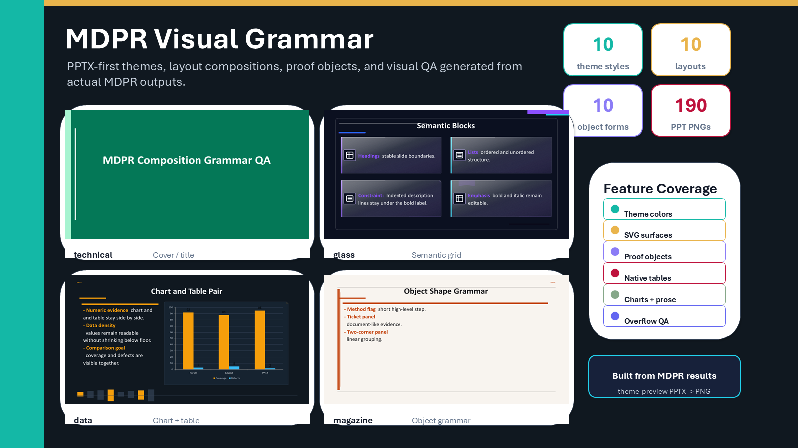

# mdpresent

`mdpresent`는 Markdown 문서를 발표 구조로 바꾸고, 그 구조를 editable `PPTX`, `HTML`, `PDF`로 렌더링하는 CLI 도구입니다. 단순 Markdown-to-PowerPoint 변환기가 아니라 `Presentation IR`과 `Layout IR`을 거치는 구조화 엔진입니다.

`mdpresent`의 런타임은 deterministic rule-based 방식입니다. 파싱, 슬라이드 분할, 레이아웃, 검증, 테마 선택, PowerPoint 렌더링은 LLM 호출이나 외부 API 없이 동작합니다. 별도 프로젝트인 [`mdpr-skill`](https://github.com/ch040602/mdpr-skill)은 reasoning companion이며, 최종 구조와 렌더링 결정은 MDPR이 담당합니다.



위 이미지는 실제 MDPR theme-preview PPTX 출력물을 PNG로 추출한 뒤, 이를 기반으로 다시 만든 README showcase입니다.

언어별 문서:

- [English README](README.md)
- [Chinese README](README.zh.md)

## 핵심 기능

- **PPTX-first**: editable PowerPoint 슬라이드를 먼저 만들고, 이를 PNG로 추출해 검수합니다.
- **No LLM runtime**: 빌드 결과는 모델 호출 없이 재현 가능합니다.
- **Markdown semantics 보존**: heading, list, emphasis, table, chart, image, code, quote, pipeline diagram을 구조로 유지합니다.
- **Design grammar**: 장식 스타일과 색상 seed를 분리하고, harmony 규칙으로 PPT theme/chart 색을 계산합니다.
- **Object coverage**: native table, native chart, proof object, icon slot, SVG-backed surface, diagram connector를 지원합니다.
- **Visual QA**: PPTX/PNG 산출물, slide count, surface marker, 언어, overflow, manifest drift를 검사합니다.

## 미리보기

[PPT 생성 기반 theme preview gallery](https://ch040602.github.io/MdPr/theme-preview/)에서 built-in style을 전환하고, 각 style별 PPTX와 PNG 슬라이드를 확인할 수 있습니다.

| Cover / Title | Pipeline Diagram |
| --- | --- |
|  |  |

| Markdown Semantics | Editable Proof Objects |
| --- | --- |
|  |  |

## 런타임 파이프라인

- Agent hint는 semantic tag나 icon keyword 같은 작은 힌트만 줄 수 있습니다.
- MDPR은 parsing, splitting, graph preservation, layout, theme color, icon search, z-order, overflow check, renderer output을 직접 결정합니다.
- 하나의 graph 또는 diagram block은 두 페이지 이상으로 쪼개지지 않습니다.


```text
Markdown
  -> Markdown AST / Simple AST
  -> Outline Tree
  -> Split Planner
  -> Presentation IR
  -> Layout Planner
  -> Override Engine
  -> QA / Overflow Checker
  -> Renderer
      -> PPTX
      -> HTML
      -> PDF
```

## 빠른 사용법

```bash
mdpresent inspect examples/basic/deck.md --json > deck.plan.json
mdpresent plan examples/basic/deck.md --json > layout.plan.json
mdpresent validate examples/basic/deck.md --override examples/basic/deck.override.yaml
mdpresent build examples/basic/deck.md --to pptx,pdf,html --out dist --design executive
mdpresent build examples/basic/deck.md --to pptx --out dist --theme-style glass --theme-color "#8A4FFF" --theme-harmony analogous --visual
mdpresent build examples/basic/deck.md --to pptx --out dist --template company-master.pptx
```

## 디자인 옵션

- `--theme-style`: `clean`, `executive`, `editorial`, `technical`, `minimalism`, `newmorphism`, `glass`, `grid`, `data`, `magazine`
- `--theme-color`: `#8A4FFF` 같은 main color seed
- `--theme-harmony`: `preset`, `monochromatic`, `analogous`, `complementary`, `split-complementary`, `triadic`
- `--theme-gallery`: 같은 Markdown을 여러 style로 반복 렌더링하여 비교
- `--design`: 기존 shared preset 선택과의 호환 옵션

## Coherence 규칙

- 렌더링 전 text를 정규화해 불필요한 공백과 이상한 줄바꿈을 줄입니다.
- List item은 번호, 들여쓰기, bold, italic 정보를 유지합니다.
- Table은 middle vertical alignment, coherent cell margin, readable minimum font size를 사용합니다.
- SVG-backed surface는 도형 크기와 무관하게 고정 corner radius를 유지합니다.
- Icon slot은 작고 중앙 정렬된 보조 요소로만 사용합니다.

## 프로젝트 구조

```text
docs/       설계, 렌더링, QA, 방법론 문서
schemas/    Config, Override, Presentation IR, Layout IR schema
packages/   core, layout, override, CLI, renderer
examples/   예시 Markdown deck과 config
scripts/    theme preview, README asset, evaluation utility
```

## GitHub Actions

- `CI`: workspace 설치, typecheck, build, test 실행
- `Theme Preview`: PPTX deck 생성, PNG 추출, artifact 검증, GitHub Pages 배포

두 workflow 모두 LLM이나 외부 API key 없이 통과해야 합니다.
