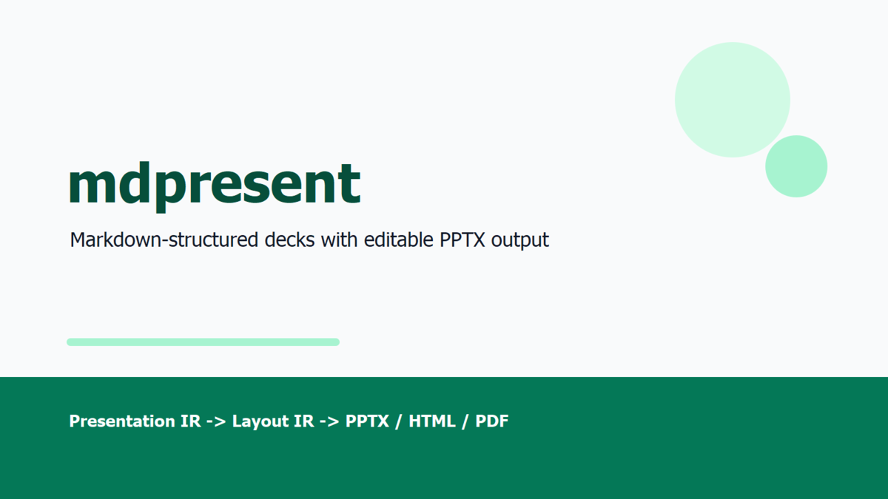
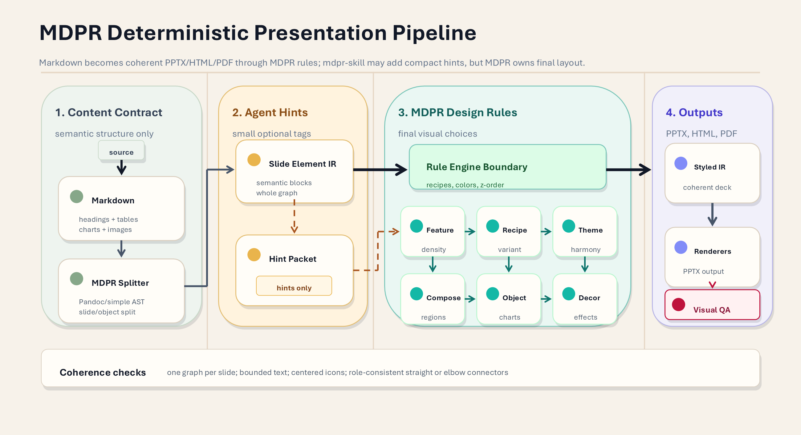
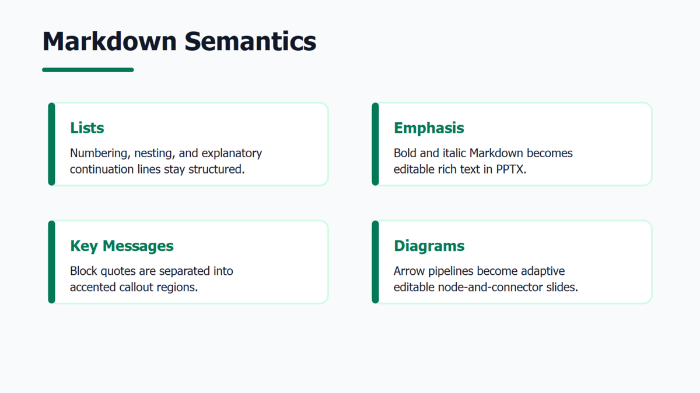

# mdpresent

`mdpresent` is not a direct Markdown-to-PowerPoint converter. It is a CLI-based presentation structuring tool that splits Markdown documents into a shared `Presentation IR`, then renders that structure to `PPTX`, `PDF`, or `HTML`.

Language variants:

- [Korean README](README.ko.md)
- [Chinese README](README.zh.md)

## Example PPT Slides

The same Markdown source can produce editable PPTX slides with responsive structure, adaptive diagrams, and reusable design presets.

[Open the interactive theme preview gallery](https://ch040602.github.io/MdPr/theme-preview/) to switch between all built-in themes, browse slides, and inspect the generated HTML deck output.

| Cover / Title | Pipeline Diagram |
| --- | --- |
|  |  |

| Markdown Semantics |
| --- |
|  |

## Core Philosophy

> A Markdown file stays the source of truth; the deck is a rendered view of that structure.

```text
Markdown is the source document.
Splitting is driven by headings and density.
Layouts are selected from intent and item count.
Exceptions are controlled through an override manifest.
PPT templates provide only backgrounds and brand assets.
Body layout is recalculated by the CLI.
```

## Pipeline

```text
Markdown
  -> Markdown AST / Simple AST
  -> Outline Tree
  -> Split Planner
  -> Presentation IR
  -> Layout Planner
  -> Override Engine
  -> QA / Overflow Checker
  -> Renderer
      ├─ PPTX
      ├─ PDF
      └─ HTML
```

## Quick Usage

```bash
mdpresent inspect examples/basic/deck.md --json > deck.plan.json
mdpresent plan examples/basic/deck.md --json > layout.plan.json
mdpresent validate examples/basic/deck.md --override examples/basic/deck.override.yaml
mdpresent build examples/basic/deck.md --to pptx,pdf,html --out dist --design executive
mdpresent build examples/basic/deck.md --to pptx --out dist --template company-master.pptx
mdpresent build examples/basic/deck.md --to pptx --config examples/basic/mdpresent.config.yaml --out dist
mdpresent build examples/basic/deck.md --to html,pptx --config examples/themes/nord.config.yaml --out dist
mdpresent build README.md --to pptx --out dist/theme-gallery --theme-gallery executive,nord,dracula,solarized
```

## Markdown Semantics

The parser preserves presentation-relevant Markdown structure and avoids flattening everything to plain paragraphs:

- Lists: ordered and unordered lists keep numbering, nesting level, and fallback text
- Cleanup: decorative empty bullet lines are removed before rendering
- Emphasis: paragraph and list-item emphasis such as `**bold**` and `*italic*` is carried into HTML and editable PPTX text runs
- Key messages: block quotes such as `> Important sentence` become separated callout regions with accent styling
- Line breaks: paragraph line breaks and sentence units are kept for safer slide splitting
- Diagrams: standalone pipeline lines such as `Draft => Review => Render` become semantic diagram blocks with adaptive horizontal, vertical, U-shaped, reverse-U, or cycle-like placement
- Diagram details: when a diagram and explanatory blocks share one section, the diagram stays on the title slide and details move to the continuation slide

## Design Presets

`--design` and `theme.designPreset` use one shared catalog across PPTX and HTML. Current presets include `plain`, `clean`, `executive`, `editorial`, `technical`, `dark`, `nord`, `solarized`, `dracula`, `tableau`, `gruvbox`, `monokai`, `material`, and `tokyo-night`.

For visual QA, `--theme-gallery executive,nord,dracula,solarized` repeats the planned slides under multiple design presets in one PPTX.

Separated key messages, ordered item cards, and label/detail list items inherit the active preset's accent colors. PPTX output keeps these as editable text, shapes, one-sided accent lines, and number badges rather than flattened images.

When `--template example.pptx` is provided, PPTX output reads the template's theme colors and non-text decorative shapes. Decorations from example slides are reused only on generated slides with the same inferred layout family, while body placeholders and arbitrary content positions are still recalculated by mdpresent.

Cover/title slides use preset-specific editable templates. Theme-gallery output shows multiple title candidates, while `--design <preset>` renders only that preset's title treatment.

## Implementation Priorities

1. Schemas: stabilize the JSON Schemas in `schemas/` first.
2. Core: build Markdown-to-`Presentation IR` in `packages/core`.
3. Layout: build `Presentation IR`-to-`Layout IR` in `packages/layout`.
4. Overrides: apply structured override manifests in `packages/override`.
5. HTML: implement `packages/render-html` first to provide preview output.
6. PDF: start `packages/render-pdf` from the HTML renderer.
7. PPTX: implement `packages/render-pptx` around editable slide objects.

## Directory Summary

```text
docs/       Final requirements and design documents
schemas/    JSON Schemas for Config, Override, Presentation IR, and Layout IR
packages/   TypeScript package scaffold
examples/   Example Markdown, config, and override files
```

## Development Workflow

1. Keep the implementation local and deterministic.
2. Do not require external API calls, API keys, or LLM calls for parsing, layout, validation, or rendering.
3. Keep generated body and item text above the readable font floor during overflow resolution.
4. Keep `schemas/*.json` stable unless a schema-contract TODO explicitly changes them.
5. Implement in this order: `packages/core`, `packages/layout`, `packages/override`, then renderers.
