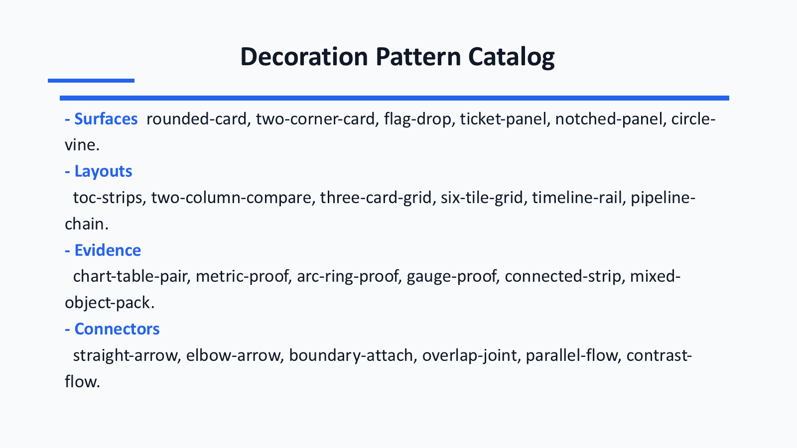
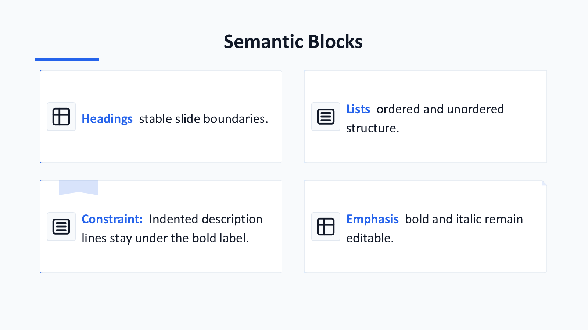
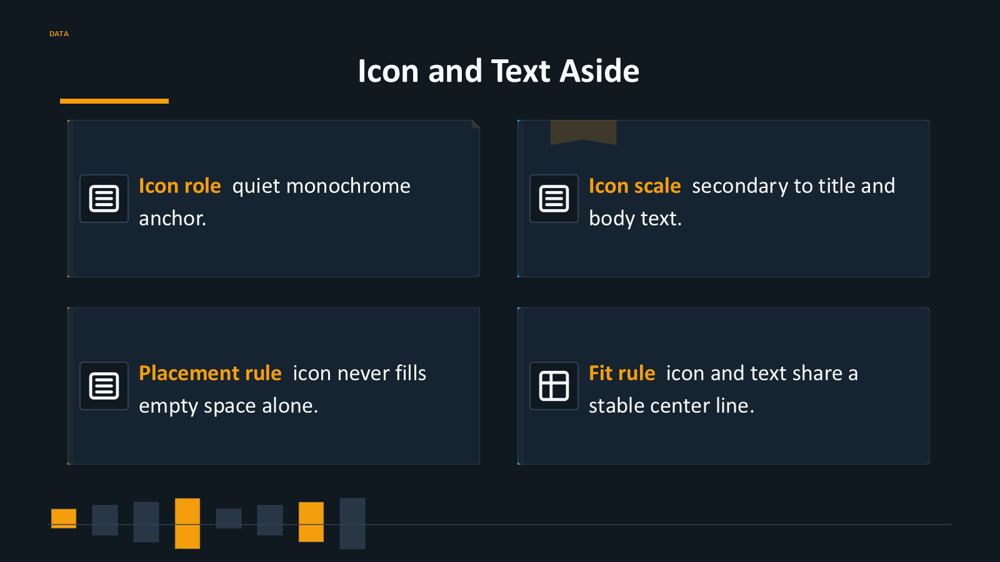
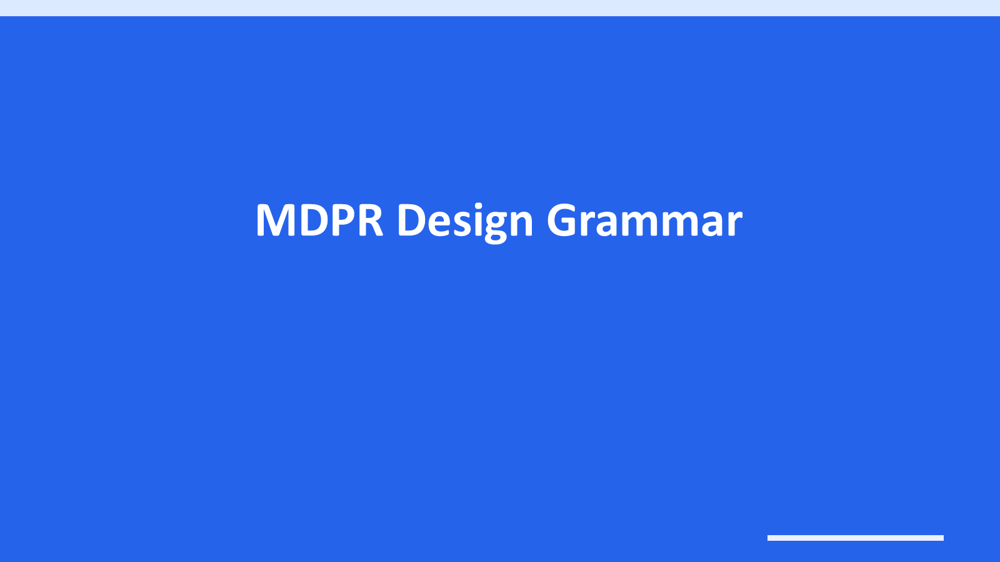
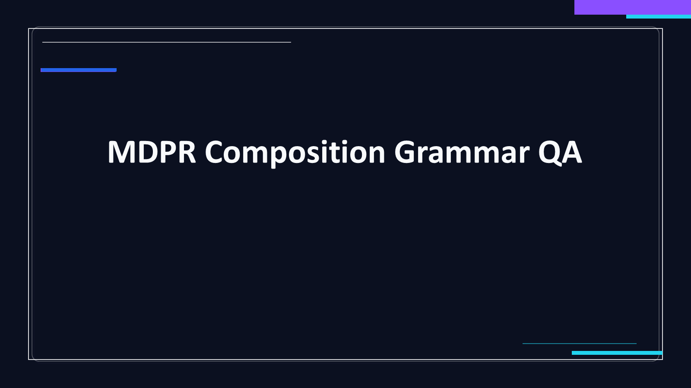
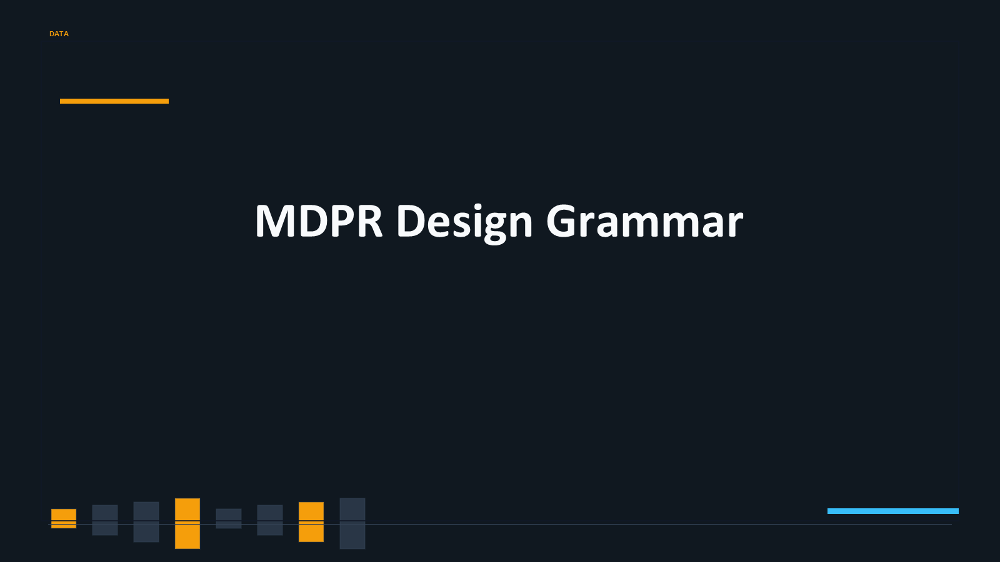

# mdpresent


`mdpresent` / **MDPR** generates editable, visually checked PowerPoint decks
from Markdown with deterministic layout rules instead of a black-box LLM
runtime.

[Preview gallery](https://ch040602.github.io/MdPr/theme-preview/) ·
[Quick usage](#quick-usage) ·
[How it differs](#how-mdpr-differs) ·
[Report a broken deck](https://github.com/ch040602/MdPr/issues/new/choose)

- **Input**: Markdown documents.
- **Intermediate model**: `Presentation IR` and `Layout IR`.
- **Outputs**: editable `PPTX`, plus `HTML` and `PDF`.
- **Runtime**: rule-based parsing, splitting, layout, validation, theme selection, and rendering.
- **LLM-advised quality**: use [`mdpr-skill`](https://github.com/ch040602/mdpr-skill) when you want agent-side semantic hints, review loops, or visual-quality advice before MDPR builds the deck.
- **Agent boundary**: [`mdpr-skill`](https://github.com/ch040602/mdpr-skill) may pass compact semantic hints through `--hints`, but MDPR rejects final layout/style decisions. MDPR owns final structure and output.
- **README assets**: the main teaser is built from `examples/readme-teaser/deck.md` with `--pipeline-one-page`; gallery images come from the shared theme preview deck. There is no README-only renderer.

Language variants: [Korean](README.ko.md), [Chinese](README.zh.md)

Contributions: [Contributing guide](CONTRIBUTING.md) ·
[Community feedback guide](docs/community-feedback.md) ·
[International launch kit](docs/international-launch-kit.md) ·
[Open a Markdown/PPTX issue](https://github.com/ch040602/MdPr/issues/new/choose)

## What It Does

- **PPTX first**: produces editable PowerPoint slides, then exports PNG previews for review.
- **Deterministic runtime**: no API key, model call, or external LLM is required for build output.
- **PDF export**: creates PPTX first, then saves that PPTX as PDF with PowerPoint on Windows or LibreOffice in CI/Linux.
- **One-page teaser mode**: `--pipeline-one-page` keeps dense pipeline, feature, chart, and table summaries on one rendered slide.
- **Markdown semantics**: parses CommonMark/GFM Markdown into an AST, then preserves headings, lists, links, emphasis, tables, HTML blocks, charts, images, code, quotes, and pipeline diagrams.
- **Design grammar**: separates decoration style from color seed and derives PPT theme/chart colors from the selected harmony.
- **Object coverage**: supports native tables, native charts, proof objects, icon slots, SVG-backed surfaces, and bounded diagram connectors.
- **Deterministic validation**: checks overflow, generated artifact contracts, slide counts, surface markers, language, and manifest drift.
- **Skill-side review**: LLM-advised layout critique, visual polish, icon keyword ideas, and high-quality deck guidance belong in [`mdpr-skill`](https://github.com/ch040602/mdpr-skill#usage), not MDPR runtime.

Best fit:

- engineering reports that must become editable PowerPoint decks
- research notes that need tables, diagrams, and claims preserved
- data/product updates that need repeatable PPTX output in CI
- teams that want optional LLM review without giving an agent final slide geometry

## How MDPR Differs

| Compared with | MDPR focus |
| --- | --- |
| **Pandoc** | Pandoc is a broad document converter. MDPR is narrower: PPTX-first layout planning, editability, overflow validation, object preservation, and generated preview QA. |
| **Marp / Slidev** | HTML/CSS slide tools are excellent for web decks. MDPR targets editable PowerPoint objects and downstream PPTX workflows. |
| **LLM slide generators** | MDPR keeps deterministic ownership of parsing, splitting, layout, colors, z-order, and renderer output. [`mdpr-skill`](https://github.com/ch040602/mdpr-skill) can suggest hints, but it cannot own final coordinates or style. |
| **Template-only automation** | MDPR derives slide structure from Markdown semantics, then applies reusable layout and theme grammar rather than filling a fixed master slide. |

If a Markdown file breaks the layout, opens as non-editable PPTX, clips text,
or loses graph/table structure, please open a
[Markdown edge-case issue](https://github.com/ch040602/MdPr/issues/new/choose)
with the smallest reproducible Markdown snippet.

## Preview Gallery

- [Open the PPT-generated theme preview gallery](https://ch040602.github.io/MdPr/theme-preview/)
- Preview scope: 5 pruned decoration styles, excluding palette-only or background-only swaps.
- Gallery artifacts: generated PPTX decks plus PNG slides extracted from PowerPoint output.

| Teaser Summary | Pipeline Diagram |
| --- | --- |
|  |  |

| Markdown Semantics | Decoration Patterns |
| --- | --- |
|  |  |

| Editable Proof Objects | Mixed Object Packing |
| --- | --- |
|  |  |

## Theme Style Examples

The same Markdown source is rendered through the pruned distinct theme styles. Each image below is exported from generated PPTX output.

| Clean | Minimalism | Newmorphism |
| --- | --- | --- |
|  |  |  |

| Glass | Data |
| --- | --- |
|  |  |

## Runtime Pipeline

- Optional agent hints may suggest semantic tags or icon-search keywords.
- Hint files are validated as weak metadata; coordinates, colors, font sizes, z-order, component choices, and renderer object IDs are rejected.
- MDPR owns parsing, splitting, graph preservation, layout, theme color derivation, icon search, z-order, overflow checks, and renderer output.
- A single graph or diagram block stays on one slide.


```text
Markdown
  -> CommonMark / GFM Markdown AST
  -> Outline Tree
  -> Split Planner
  -> Presentation IR
  -> Layout Planner
  -> Override Engine
  -> Validation / Overflow Checker
  -> Renderer
      -> PPTX
      -> HTML
      -> PDF
```

## Quick Usage

Installable CLI package:

```bash
npm install -g @mdpresent/cli
mdpresent build examples/basic/deck.md --to pptx,pdf,html --out dist --design executive
```

Repository development:

```bash
corepack pnpm install
corepack pnpm --filter @mdpresent/cli build
node packages/cli/dist/index.js build examples/basic/deck.md --to pptx --out dist
```

Common commands:

```bash
mdpresent inspect examples/basic/deck.md --json > deck.plan.json
mdpresent plan examples/basic/deck.md --json > layout.plan.json
mdpresent validate examples/basic/deck.md --override examples/basic/deck.override.yaml --coherence
mdpresent validate examples/basic/deck.md --hints examples/basic/deck.mdpr-hints.json --strict
mdpresent build examples/basic/deck.md --to pptx,pdf,html --out dist --design executive
mdpresent build examples/basic/deck.md --to pptx --out dist --theme-style glass --theme-color "#8A4FFF" --theme-harmony analogous --visual --coherence
mdpresent build examples/readme-teaser/deck.md --to pptx --out dist/readme-teaser --theme-style clean --theme-color "#0F766E" --theme-harmony split-complementary --pipeline-one-page --visual
mdpresent build examples/basic/deck.md --to pptx --out dist --template company-master.pptx
mdpresent build README.md --to pptx --out dist/theme-gallery --theme-gallery clean,minimalism,newmorphism,glass,data
```

`--parser pandoc` is an advanced compatibility mode for users who need Pandoc
Markdown normalization. It requires `pandoc` on `PATH`, but MDPR does not use
Pandoc output as the presentation model. The Pandoc JSON AST is adapted back
into MDPR semantic blocks, including diagrams, chart fences, structured lists,
images, tables, code, and Div attributes. The default parser does not require
Pandoc and uses the built-in CommonMark/GFM AST path.

## Design Controls

- `--theme-style`: `clean`, `executive`, `technical`, `minimalism`, `newmorphism`, `glass`, `data`
- `--theme-color`: main color seed such as `#8A4FFF`
- `--theme-harmony`: `preset`, `monochromatic`, `analogous`, `complementary`, `split-complementary`, `triadic`
- `--pipeline-one-page`: creates a single-slide pipeline/teaser composition from multi-section Markdown while keeping the shared parser, layout planner, validation, and renderers
- `--design`: compatibility alias for legacy/shared preset selection
- `--theme-gallery`: repeats the same source deck under multiple style presets for visual comparison; README/Actions previews use the pruned distinct-style subset

## Coherence Rules

- Text is normalized before validation and rendering.
- Rich list items preserve ordered numbering, indentation, bold, and italic runs.
- Plain TOC/list entries render as separate editable PPTX text boxes to avoid collapsed line breaks.
- Tables use middle vertical alignment, coherent cell margins, preset-derived borders, and a readable font floor.
- SVG-backed surfaces keep fixed corner radii so shape size does not change the perceived roundness.
- Icon slots remain small, centered, monotone, and secondary to text.

## Project Map

```text
docs/       Design, rendering, validation, and methodology notes
schemas/    Config, Override, Presentation IR, and Layout IR schemas
packages/   Core, layout, override, CLI, and renderers
examples/   Example Markdown decks and configs
scripts/    Shared theme preview export and evaluation utilities
```

Implementation order:

1. Keep schemas stable unless the task explicitly changes a schema contract.
2. Build Markdown-to-`Presentation IR` in `packages/core`.
3. Build `Presentation IR`-to-`Layout IR` in `packages/layout`.
4. Apply override manifests in `packages/override`.
5. Keep `packages/render-pptx` as the primary editable-object renderer.
6. Keep `packages/render-html` as a gallery/preview shell.
7. Keep `packages/render-pdf` as an export path.

## GitHub Actions

- `CI`: installs the workspace, typechecks, builds, and runs tests.
- `Theme Preview`: regenerates PPTX decks, rasterizes slides to PNG, verifies artifacts, and publishes the gallery to GitHub Pages.

These checks must pass without an LLM or external API key.

## Acknowledgements

- README preview source: `examples/theme-preview-en/deck.md`
- One-page teaser source: `examples/readme-teaser/deck.md`
- Main teaser image: `docs/assets/readme-teaser/slides/slide-01.png?v=clean-pipeline-one-page`
- Main teaser PPTX: `docs/assets/readme-teaser/deck.pptx`
- Pipeline image: `docs/theme-preview/slides/clean/slide-11.png`

References:

| Reference | Use |
| --- | --- |
| [Google Material Design Icons](https://github.com/google/material-design-icons) | general icon style reference |
| [Simple Icons](https://github.com/simple-icons/simple-icons) | explicit brand icon reference |
| [SVG Repo](https://www.svgrepo.com/) | generic SVG object reference |
| [Tabler Icons](https://github.com/tabler/tabler-icons) | restrained concept glyph reference |
