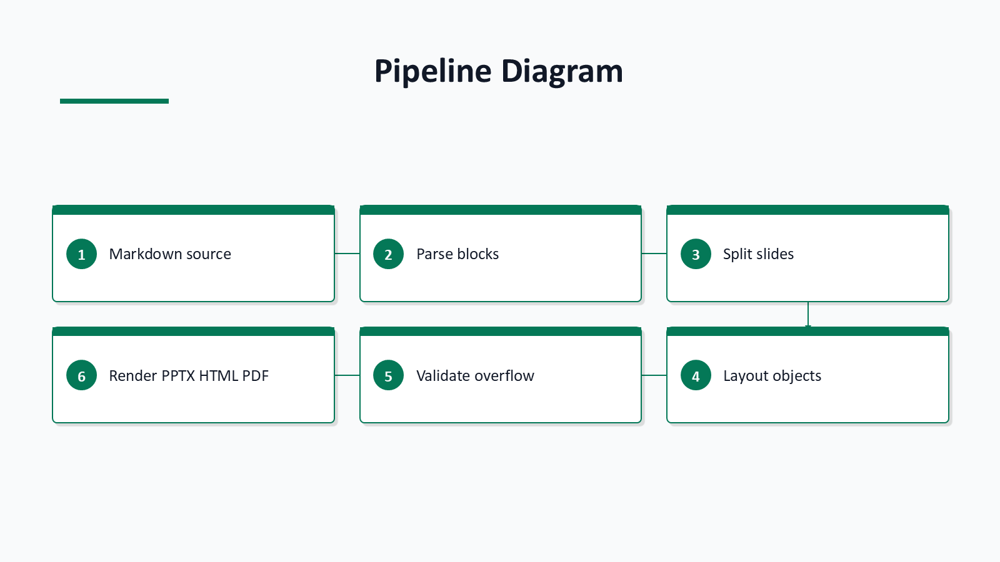
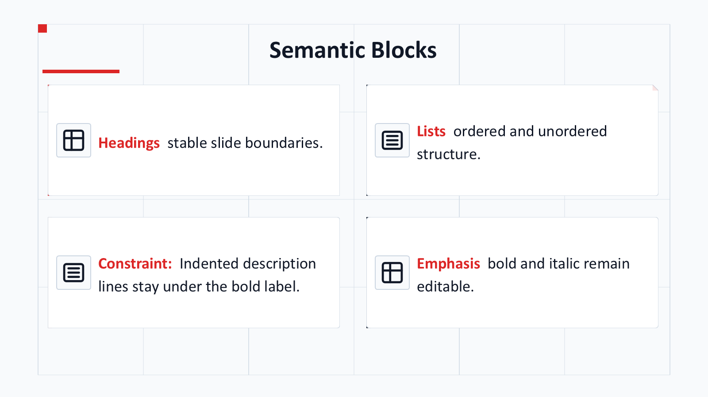
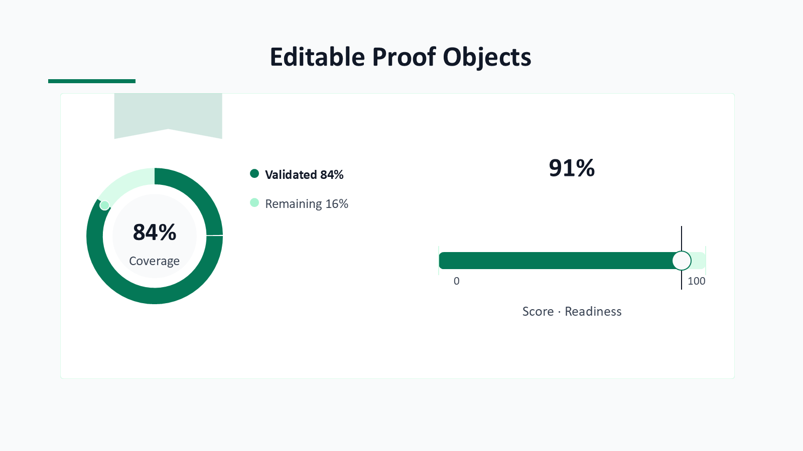

# mdpresent

`mdpresent` is not a direct Markdown-to-PowerPoint converter. It is a CLI-based presentation structuring tool that splits Markdown documents into a shared `Presentation IR`, then renders that structure to `PPTX`, `PDF`, or `HTML`.

`mdpresent` is the main deterministic runtime. Parsing, splitting, layout, validation, theme selection, editable object rendering, and PowerPoint output are rule-based and require no LLM calls. The separate [`mdpr-skill`](https://github.com/ch040602/mdpr-skill) project is only a reasoning companion: it can prepare compact semantic hints or review artifacts, but MDPR may ignore those hints and still build the deck deterministically.


The teaser above is generated as a one-slide PowerPoint deck at `docs/assets/readme-slides/mdpr-pipeline-teaser.pptx`, exported through Microsoft PowerPoint to `docs/assets/readme-slides/mdpr-pipeline-teaser.png`, and kept as a README image. Its design follows recent CHI-style teaser conventions: a single readable overview image, explicit research/system object, clear pipeline hierarchy, a visible proof/validation point, and restrained visual emphasis instead of decorative filler.

Language variants:

- [Korean README](README.ko.md)
- [Chinese README](README.zh.md)

## PPTX-First Example Slides

The same Markdown source produces editable PPTX decks first. The preview gallery is built by rendering those PPTX files, exporting each slide to PNG, and using HTML only as the navigation shell.

[Open the PPT-generated theme preview gallery](https://ch040602.github.io/MdPr/theme-preview/) to switch between built-in decoration styles, download the generated PPTX deck for each style, and inspect PNG slide images extracted from PowerPoint output.

| PPTX Cover / Title | PPTX Pipeline Diagram |
| --- | --- |
|  |  |

| PPTX Semantic Blocks | PPTX Editable Proof Objects |
| --- | --- |
|  |  |

## Runtime Pipeline

MDPR keeps the runtime deterministic:

- Optional agent hints may suggest compact semantic tags or icon-search keywords before design selection.
- MDPR owns parsing, slide/object splitting, graph preservation, layout, theme color derivation, editable proof objects, local icon catalog search, icon slots, z-order, overflow checks, and renderer output.


## Core Philosophy

> A Markdown file stays the source of truth; the deck is a rendered view of that structure.

```text
Markdown is the source document.
Splitting is driven by headings and density.
Layouts are selected from intent and item count.
Exceptions are controlled through an override manifest.
PPT templates provide only backgrounds and brand assets.
Body layout is recalculated by the CLI.
```

## Pipeline

```text
Markdown
  -> Markdown AST / Simple AST
  -> Outline Tree
  -> Split Planner
  -> Presentation IR
  -> Layout Planner
  -> Override Engine
  -> QA / Overflow Checker
  -> Renderer
      ├─ PPTX
      ├─ PDF
      └─ HTML
```

## Quick Usage

```bash
mdpresent inspect examples/basic/deck.md --json > deck.plan.json
mdpresent plan examples/basic/deck.md --json > layout.plan.json
mdpresent validate examples/basic/deck.md --override examples/basic/deck.override.yaml
mdpresent build examples/basic/deck.md --to pptx,pdf,html --out dist --design executive
mdpresent build examples/basic/deck.md --to pptx --out dist --theme-style glass --theme-color "#8A4FFF" --theme-harmony analogous --visual
mdpresent build examples/basic/deck.md --to pptx --out dist --template company-master.pptx
mdpresent build examples/basic/deck.md --to pptx --config examples/basic/mdpresent.config.yaml --out dist
mdpresent build examples/basic/deck.md --to html,pptx --config examples/themes/nord.config.yaml --out dist
mdpresent build README.md --to pptx --out dist/theme-gallery --theme-gallery executive,editorial,technical,clean
```

## Semantics and Design

The parser preserves presentation-relevant Markdown structure: lists, emphasis, key messages, line breaks, diagrams, tables, charts, and image blocks remain typed content instead of being flattened into paragraphs. One graph or diagram block stays on one slide.

`--design` and `theme.designPreset` use one shared catalog across PPTX and HTML. `theme.decorationStyle` or `--theme-style` selects the visual grammar, while `theme.colorSeed` or `--theme-color` selects the main color. `theme.colorCombination` or `--theme-harmony` derives the PowerPoint theme accents and chart colors from that seed.

Detailed rules are split out of this README: [methodology](docs/12-design-methodology.md), [object forms and icon paths](docs/13-object-forms-and-icons.md), [renderer rules](docs/07-rendering-rules.md), and [QA/overflow rules](docs/11-qa-overflow.md).

For visual QA, `--theme-gallery executive,editorial,technical,clean` repeats the planned slides under multiple design presets in one PPTX. The Actions preview page lists decoration styles whose layout, scale hierarchy, proof objects, and surface grammar differ; legacy color-only presets remain available through `--design` for compatibility. `pnpm preview:themes` regenerates PPTX decks under `docs/theme-preview/pptx/`, exports PNG slides under `docs/theme-preview/slides/`, and runs `scripts/evaluate-theme-preview.mjs` against those PPT-derived artifacts. Every `build` writes a deterministic `mdpresent-design-lock.json` and `mdpresent-manifest.json`; use `--visual` to add structural visual-validation summaries.

## Text and Table Coherence

Markdown text is normalized before layout validation and rendering. Repeated spaces and tabs collapse to a single space in paragraphs, inline emphasis runs, list text, and table cells, while meaningful Markdown lines remain available for slide splitting and readable PPTX text boxes.

Plain TOC/list entries are rendered as separate editable text boxes in PPTX output to avoid collapsed PowerPoint rich-text line breaks. Rich list items still preserve bold and italic runs.

Simple Markdown tables now carry validation text in addition to row data, matching the Pandoc table path. This lets the overflow resolver measure table content instead of treating dense tables as empty regions. PPTX tables use middle vertical alignment, coherent cell margins, preset-derived header fills and borders, and never shrink below the configured readable minimum font size.

## Implementation Priorities

1. Schemas: stabilize the JSON Schemas in `schemas/` first.
2. Core: build Markdown-to-`Presentation IR` in `packages/core`.
3. Layout: build `Presentation IR`-to-`Layout IR` in `packages/layout`.
4. Overrides: apply structured override manifests in `packages/override`.
5. PPTX: keep `packages/render-pptx` as the primary editable-object renderer.
6. HTML: keep `packages/render-html` as a lightweight browser preview and gallery shell.
7. PDF: keep `packages/render-pdf` as a document export path.

## Directory Summary

```text
docs/       Final requirements and design documents
schemas/    JSON Schemas for Config, Override, Presentation IR, and Layout IR
packages/   TypeScript package scaffold
examples/   Example Markdown, config, and override files
```

## Development Workflow

1. Keep the implementation local and deterministic.
2. Do not require external API calls, API keys, or LLM calls for parsing, layout, validation, or rendering.
3. Keep generated body and item text above the readable font floor during overflow resolution.
4. Keep `schemas/*.json` stable unless a schema-contract TODO explicitly changes them.
5. Implement in this order: `packages/core`, `packages/layout`, `packages/override`, then renderers.
6. Build requests for multiple independent formats run through the shared plan once and render requested outputs such as HTML and PPTX as parallel jobs.

## GitHub Actions

The repository runs two Actions workflows:

- `CI` installs the pnpm workspace, runs typecheck, builds all packages, and runs tests on push, pull request, and manual dispatch.
- `Theme Preview` builds the package workspace, regenerates PPTX decks from the theme/object QA Markdown, rasterizes those PPTX slides to PNG, verifies the generated artifact set, and publishes the PNG gallery to GitHub Pages. Pull requests run the same build and rasterization checks without deploying Pages.

These checks protect the deterministic MDPR runtime. The optional [`mdpr-skill`](https://github.com/ch040602/mdpr-skill) repository may prepare semantic hints and review artifacts, but MDPR's Actions must pass without an LLM or external API key.

## Acknowledgements

MDPR stores rendered README teaser assets at `docs/assets/readme-slides/mdpr-pipeline-teaser.svg`, `docs/assets/readme-slides/mdpr-pipeline-teaser.pptx`, and `docs/assets/readme-slides/mdpr-pipeline-teaser.png`.

| Reference | Use |
| --- | --- |
| [Google Material Design Icons](https://github.com/google/material-design-icons) | general icon style reference |
| [Simple Icons](https://github.com/simple-icons/simple-icons) | explicit brand icon reference |
| [SVG Repo](https://www.svgrepo.com/) | generic SVG object reference |
| [Tabler Icons](https://github.com/tabler/tabler-icons) | restrained concept glyph reference |
