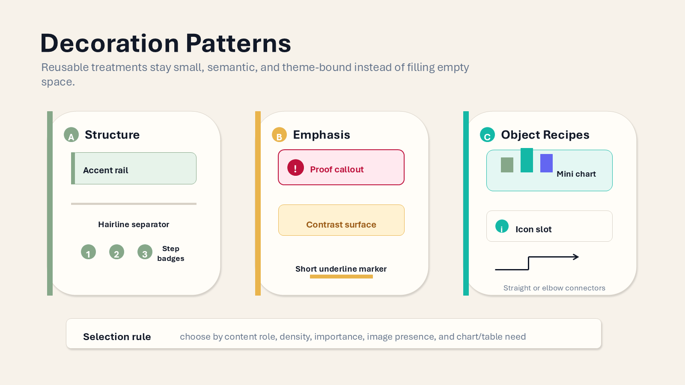

# mdpresent

`mdpresent` is not a direct Markdown-to-PowerPoint converter. It is a CLI-based presentation structuring tool that splits Markdown documents into a shared `Presentation IR`, then renders that structure to `PPTX`, `PDF`, or `HTML`.

`mdpresent` is the main deterministic runtime. Parsing, splitting, layout, validation, theme selection, editable object rendering, and PowerPoint output are rule-based and require no LLM calls. The separate `mdpr-skill` project is only a reasoning companion: it can prepare compact semantic hints or review artifacts, but MDPR may ignore those hints and still build the deck deterministically.


The teaser above is generated as a one-slide PowerPoint deck at `docs/assets/readme-slides/mdpr-pipeline-teaser.pptx`, exported through Microsoft PowerPoint to `docs/assets/readme-slides/mdpr-pipeline-teaser.png`, and kept as a README image. Its design follows recent CHI-style teaser conventions: a single readable overview image, explicit research/system object, clear pipeline hierarchy, a visible proof/validation point, and restrained visual emphasis instead of decorative filler.

Language variants:

- [Korean README](README.ko.md)
- [Chinese README](README.zh.md)

## Example PPT Slides

The same Markdown source can produce editable PPTX slides with responsive structure, adaptive diagrams, and reusable design presets.

[Open the interactive theme preview gallery](https://ch040602.github.io/MdPr/theme-preview/) to switch between all built-in themes, browse slides, and inspect the generated HTML deck output.

| Cover / Title | Pipeline Diagram |
| --- | --- |
|  |  |

| Markdown Semantics | Decoration Patterns |
| --- | --- |
|  |  |

## Runtime Pipeline

MDPR keeps the runtime deterministic. Optional agent hints may suggest compact semantic tags before design selection, but MDPR owns parsing, slide/object splitting, graph preservation, layout, theme color derivation, editable proof objects, icon slots, z-order, overflow checks, and renderer output.


## Core Philosophy

> A Markdown file stays the source of truth; the deck is a rendered view of that structure.

```text
Markdown is the source document.
Splitting is driven by headings and density.
Layouts are selected from intent and item count.
Exceptions are controlled through an override manifest.
PPT templates provide only backgrounds and brand assets.
Body layout is recalculated by the CLI.
```

## Pipeline

```text
Markdown
  -> Markdown AST / Simple AST
  -> Outline Tree
  -> Split Planner
  -> Presentation IR
  -> Layout Planner
  -> Override Engine
  -> QA / Overflow Checker
  -> Renderer
      ├─ PPTX
      ├─ PDF
      └─ HTML
```

## Quick Usage

```bash
mdpresent inspect examples/basic/deck.md --json > deck.plan.json
mdpresent plan examples/basic/deck.md --json > layout.plan.json
mdpresent validate examples/basic/deck.md --override examples/basic/deck.override.yaml
mdpresent build examples/basic/deck.md --to pptx,pdf,html --out dist --design executive
mdpresent build examples/basic/deck.md --to pptx --out dist --template company-master.pptx
mdpresent build examples/basic/deck.md --to pptx --config examples/basic/mdpresent.config.yaml --out dist
mdpresent build examples/basic/deck.md --to html,pptx --config examples/themes/nord.config.yaml --out dist
mdpresent build README.md --to pptx --out dist/theme-gallery --theme-gallery executive,nord,dracula,solarized
```

## Markdown Semantics

The parser preserves presentation-relevant Markdown structure and avoids flattening everything to plain paragraphs:

- Lists: ordered and unordered lists keep numbering, nesting level, and fallback text
- Cleanup: decorative empty bullet lines are removed before rendering
- Emphasis: paragraph and list-item emphasis such as `**bold**` and `*italic*` is carried into HTML and editable PPTX text runs
- Key messages: block quotes such as `> Important sentence` become separated callout regions with accent styling
- Line breaks: paragraph line breaks and sentence units are kept for safer slide splitting
- Diagrams: standalone pipeline lines such as `Draft => Review => Render` become semantic diagram blocks with adaptive horizontal, vertical, U-shaped, reverse-U, or cycle-like placement
- Diagram integrity: one graph or diagram block stays on a single slide; MDPR does not split a diagram across continuation pages
- Numeric storytelling: chart slides can keep a short prose explanation beside the chart, while chart-plus-table slides keep the graph and table in parallel regions

## Design Presets

`--design` and `theme.designPreset` use one shared catalog across PPTX and HTML. Current presets include `plain`, `clean`, `executive`, `editorial`, `technical`, `dark`, `nord`, `solarized`, `dracula`, `tableau`, `gruvbox`, `monokai`, `material`, and `tokyo-night`.

`theme.colorCombination` can derive Adobe Color Wheel-style palettes from `theme.primaryColor` on top of a preset. Supported values are `preset`, `monochromatic`, `analogous`, `complementary`, `split-complementary`, and `triadic`. Derived colors use harmony hue offsets plus saturation/lightness tuning, feed element accents and chart color tokens, and are registered into the generated PowerPoint document theme colors (`accent1` through `accent6`).

Chart fences support native PowerPoint bar charts and editable chart proof objects. Use `chart` or `bar` for native bar charts, `arc-ring` for progress/ratio rings, `gauge` for score/readiness gauges, `connected-strip` for small-multiple flow metrics, `ranked-bars` for ranked evidence, and `metric-dots` for compact status/progress indicators. Generic `chart` fences may also declare `kind: arc-ring`, `kind: gauge`, `kind: connected-strip`, `kind: ranked-bars`, or `kind: metric-dots`.

Current editable object families include cover/title text, paragraph text, ordered and unordered list cards, quote callouts, code windows, single-card layouts, comparison cards, vertical-list cards, 2x2 and 3x2 grid cards, pentagon/radial cards, native tables, native bar charts, chart-beside-prose, chart-plus-table, pipeline diagrams, image-focus layouts, image-beside-text layouts, text-icon-aside support, preset backgrounds, region surfaces, accent rails, number badges, icon badges, proof callouts, theme colors, and template assets.

Text-only relief and item-card badges use restrained Material Icons-inspired monochrome glyphs. The icons follow the Material 24px box assumption, are centered inside their icon slot, and remain secondary to the text.

When a chart slide contains prose but no table, MDPR reserves a left explanation region and a wider right chart region so interpretation and evidence are read together. When the same slide contains a table, MDPR preserves the chart-plus-table parallel layout and keeps table text vertically centered with readable margins.

For visual QA, `--theme-gallery executive,nord,dracula,solarized` repeats the planned slides under multiple design presets in one PPTX.

Separated key messages, ordered item cards, and label/detail list items inherit the active preset's accent colors. PPTX output keeps these as editable text, shapes, one-sided accent lines, and number badges rather than flattened images.

When `--template example.pptx` is provided, PPTX output reads the template's theme colors and non-text decorative shapes. Decorations from example slides are reused only on generated slides with the same inferred layout family, while body placeholders and arbitrary content positions are still recalculated by mdpresent.

Cover/title slides use preset-specific editable templates. Theme-gallery output shows multiple title candidates, while `--design <preset>` renders only that preset's title treatment.

## Text and Table Coherence

Markdown text is normalized before layout validation and rendering. Repeated spaces and tabs collapse to a single space in paragraphs, inline emphasis runs, list text, and table cells, while meaningful Markdown lines remain available for slide splitting and readable PPTX text boxes.

Plain TOC/list entries are rendered as separate editable text boxes in PPTX output to avoid collapsed PowerPoint rich-text line breaks. Rich list items still preserve bold and italic runs.

Simple Markdown tables now carry validation text in addition to row data, matching the Pandoc table path. This lets the overflow resolver measure table content instead of treating dense tables as empty regions. PPTX tables use middle vertical alignment, coherent cell margins, preset-derived header fills and borders, and never shrink below the configured readable minimum font size.

## Implementation Priorities

1. Schemas: stabilize the JSON Schemas in `schemas/` first.
2. Core: build Markdown-to-`Presentation IR` in `packages/core`.
3. Layout: build `Presentation IR`-to-`Layout IR` in `packages/layout`.
4. Overrides: apply structured override manifests in `packages/override`.
5. HTML: implement `packages/render-html` first to provide preview output.
6. PDF: start `packages/render-pdf` from the HTML renderer.
7. PPTX: implement `packages/render-pptx` around editable slide objects.

## Directory Summary

```text
docs/       Final requirements and design documents
schemas/    JSON Schemas for Config, Override, Presentation IR, and Layout IR
packages/   TypeScript package scaffold
examples/   Example Markdown, config, and override files
```

## Development Workflow

1. Keep the implementation local and deterministic.
2. Do not require external API calls, API keys, or LLM calls for parsing, layout, validation, or rendering.
3. Keep generated body and item text above the readable font floor during overflow resolution.
4. Keep `schemas/*.json` stable unless a schema-contract TODO explicitly changes them.
5. Implement in this order: `packages/core`, `packages/layout`, `packages/override`, then renderers.
6. Build requests for multiple independent formats run through the shared plan once and render requested outputs such as HTML and PPTX as parallel jobs.

## GitHub Actions

The repository runs two Actions workflows:

- `CI` installs the pnpm workspace, runs typecheck, builds all packages, and runs tests on push, pull request, and manual dispatch.
- `Theme Preview` builds the package workspace, regenerates the theme preview gallery, and publishes it to GitHub Pages.

These checks protect the deterministic MDPR runtime. The optional `mdpr-skill` repository may prepare semantic hints and review artifacts, but MDPR's Actions must pass without an LLM or external API key.
