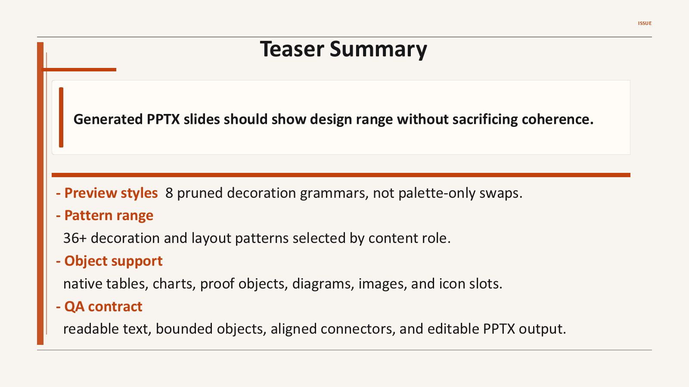
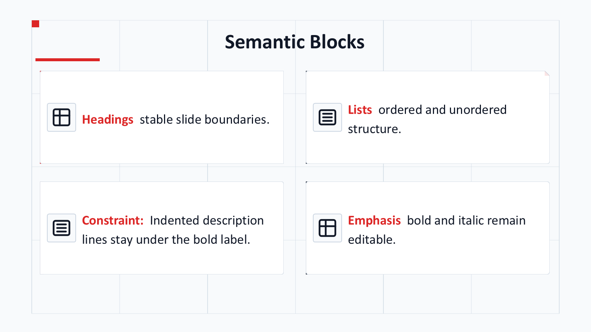
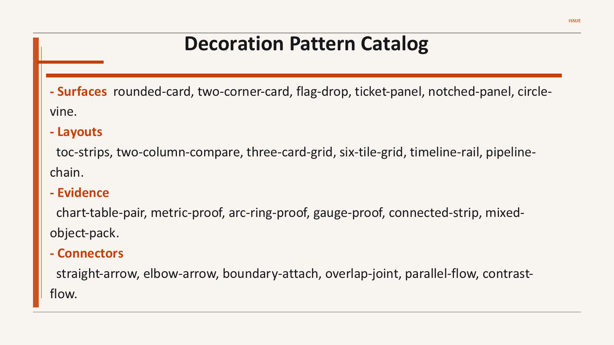
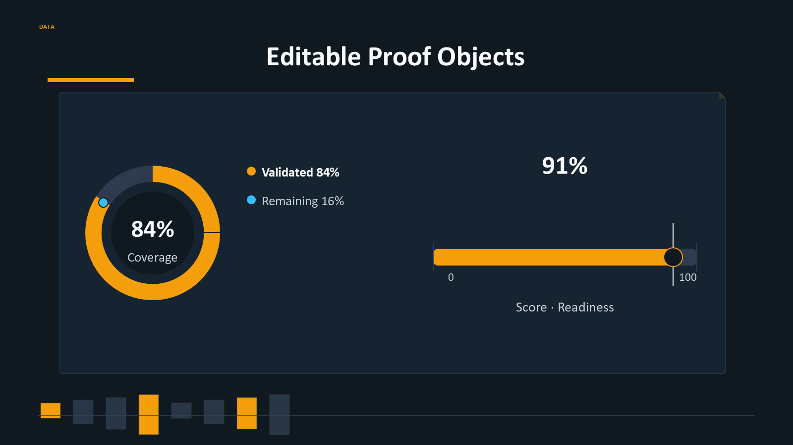
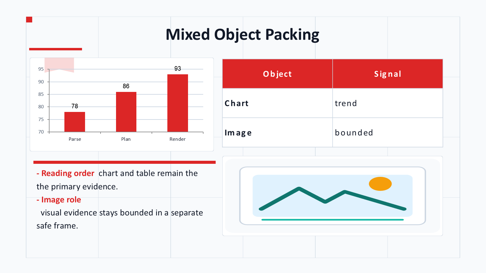

# mdpresent



`mdpresent` 是 deterministic Markdown presentation runtime。

- **Input**：Markdown documents
- **Intermediate model**：`Presentation IR` and `Layout IR`
- **Outputs**：editable `PPTX`, `HTML`, and `PDF`
- **Runtime**：rule-based parsing, splitting, layout, validation, theme selection, and rendering
- **Agent boundary**：[`mdpr-skill`](https://github.com/ch040602/mdpr-skill) may suggest compact semantic hints, but MDPR owns final structure and output.
- **README assets**：exported from the shared `examples/theme-preview-en/deck.md` PPTX preview deck, with no README-only renderer.

语言版本：[English](README.md), [Korean](README.ko.md)

## 核心功能

- **PPTX first**：先生成可编辑 PowerPoint，再导出 PNG 进行检查。
- **No LLM runtime**：构建结果不依赖模型调用，可重复生成。
- **Markdown semantics**：保留 heading、list、emphasis、table、chart、image、code、quote 和 pipeline diagram。
- **Design grammar**：将 decoration style 与 color seed 分离，并根据 harmony 规则生成 PPT theme/chart colors。
- **Object coverage**：支持 native table、native chart、proof object、icon slot、SVG-backed surface 和 diagram connector。
- **Visual QA**：检查 PPTX/PNG artifact、slide count、surface marker、语言、overflow 和 manifest drift。

## 预览

- [Open the PPT-generated theme preview gallery](https://ch040602.github.io/MdPr/theme-preview/)
- Preview scope: 8 pruned decoration styles, excluding palette-only or background-only swaps.
- Gallery artifacts: generated PPTX decks plus PNG slides extracted from PowerPoint output.

| Teaser Summary | Pipeline Diagram |
| --- | --- |
|  |  |

| Markdown Semantics | Decoration Patterns |
| --- | --- |
|  |  |

| Editable Proof Objects | Mixed Object Packing |
| --- | --- |
|  |  |

## Runtime Pipeline

- Agent hint 只能提供 compact semantic tag 或 icon keyword。
- MDPR 负责 parsing、splitting、graph preservation、layout、theme color、icon search、z-order、overflow check 和 renderer output。
- 一个 graph 或 diagram block 不会被拆成两页以上。


```text
Markdown
  -> Markdown AST / Simple AST
  -> Outline Tree
  -> Split Planner
  -> Presentation IR
  -> Layout Planner
  -> Override Engine
  -> QA / Overflow Checker
  -> Renderer
      -> PPTX
      -> HTML
      -> PDF
```

## 快速使用

```bash
mdpresent inspect examples/basic/deck.md --json > deck.plan.json
mdpresent plan examples/basic/deck.md --json > layout.plan.json
mdpresent validate examples/basic/deck.md --override examples/basic/deck.override.yaml
mdpresent build examples/basic/deck.md --to pptx,pdf,html --out dist --design executive
mdpresent build examples/basic/deck.md --to pptx --out dist --theme-style glass --theme-color "#8A4FFF" --theme-harmony analogous --visual
mdpresent build examples/basic/deck.md --to pptx --out dist --template company-master.pptx
```

## Design Controls

- `--theme-style`: `clean`, `executive`, `editorial`, `technical`, `minimalism`, `newmorphism`, `glass`, `grid`, `data`, `magazine`
- `--theme-color`: main color seed，例如 `#8A4FFF`
- `--theme-harmony`: `preset`, `monochromatic`, `analogous`, `complementary`, `split-complementary`, `triadic`
- `--theme-gallery`: 用多个 style 重复渲染同一个 Markdown 以便比较。README/Actions preview 只使用 distinct style subset。
- `--design`: legacy/shared preset 兼容选项

## Coherence Rules

- 渲染前会规范化 text，减少多余空格和异常换行。
- List item 会保留编号、缩进、bold 和 italic 信息。
- Table 使用 middle vertical alignment、coherent cell margin 和 readable minimum font size。
- SVG-backed surface 使用固定 corner radius，避免不同尺寸改变圆角观感。
- Icon slot 只作为小型、居中、单色的辅助元素。

## Project Map

```text
docs/       design, rendering, QA, and methodology documents
schemas/    Config, Override, Presentation IR, and Layout IR schemas
packages/   core, layout, override, CLI, and renderers
examples/   example Markdown decks and configs
scripts/    shared theme preview export and evaluation utilities
```

## GitHub Actions

- `CI`: installs the workspace, typechecks, builds, and runs tests.
- `Theme Preview`: generates PPTX decks, exports PNG slides, verifies artifacts, and publishes GitHub Pages.

Both workflows must pass without an LLM or external API key.
